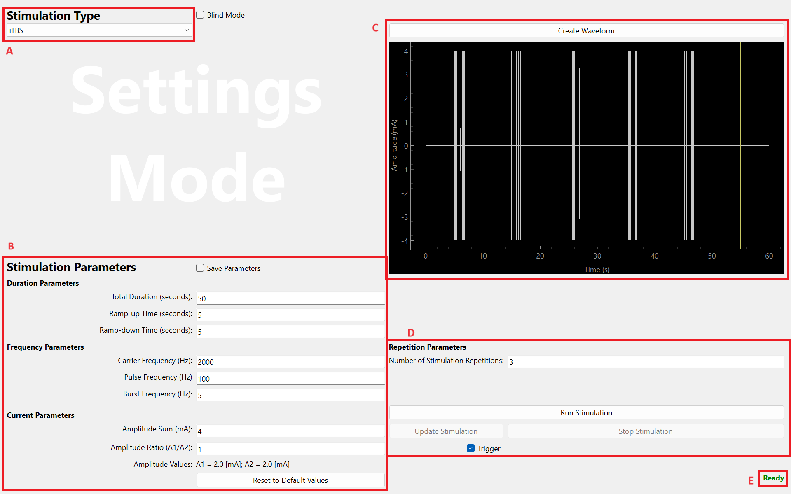

# HummelGUI
The Graphical User Interface (GUI) proposed here controls a data aquisition system (DAQ) that can be used control electrodes for non-invasive brain stimulation. This repository contains the code for the GUI, as well as utility files, notably for defaults values. The following sections explain the GUI's dependencies and compatibility with DAQs, as well as its functionalities and features.
___
## GUI Functionalities
The GUI proposed here offers two seperate modes. 
### Settings Mode
Firstly, a "Settings Mode" is available to manually select a stimulation type, adjust parameters, and plot corresponding waveforms for visualisation. This mode is meant for testing, preparing and checking a specific setup or stimulation type. The "Settings Mode" is presented as follows.

In this mode, one first selects the base stimulation type from the corresponding dropdown menu. Currently available stimulations include iTBS, cTBS, TBS control and TI. These can be selected as follows. As a note, how to add new stimulation types is explained further down.

Once the stimulation type is selected, the default parameters defined in [util.py](HummelGUI/util.py) can be modified directly through the GUI. The parameters that may be modified include duration parameters such as total duration of the stimulation, ramp-up and ramp-down time, frequency parameters such as carrier, pulse and burst frequencies, and current parameters such as the sum and ratio of currents. Default parameters can be reset thanks to the corresponding button. These settings are found as shown below.

Once parameters are chosen, the resulting waveform can be plotted and shown on the GUI for verification. As a note, in "Settings Mode", this step is necessary before being able to run the stimulation. This is done by pressing the corresponding button as shown below.

As mentioned, once plotted, buttons to run the stimulation become available. These are accessible at the bottom right corner of the GUI. If the "trigger" checkbox is selected, pressing this button will prime the stimulation and wait for an external trigger to begin. In addition, "update" and "stop" buttons become available during a stimulation, to update to a new stimulation type or parameters or stop the stimulation before its predefined end. Also, a number of times the stimulation is to be run ca be selected. Importantly, this count does not reset when updating the stimulation. These settings are available as follows.

Finally, a label will guide the experimenter in the use of the GUI. This label indicates if a stimulation is running, waiting for a trigger, ramping-down after pressing the "stop" button or waiting for the experimenter to select a stimulation. Other labels will appear in the other mode. The label is present under the buttons to control the stimulation.

### Blind Mode
Secondly, a "Blind Mode" is available to carry out experiments on participants for a study. In this mode, the stimulation type, waveform and all parameters are hidden from the experimenter. Instead, the experimenter can enter the subject and session's ID, corresponding to a pre-prepared excel file. From this file, the stimulation type is chosen according to the IDs, and the parameters are read from default values. These default values can be preset in [util.py](HummelGUI/util.py). The experimenter selects these IDs from the corresponding drop down menus.

Once chosen, the experimenter uses the button to load the corresponding stimulation. The label discussed above will then provide information on the status of the GUI. If all is in order, the GUI will be "Ready". Otherwise, the label will indicate to the experimenter of an issue. This issue may be a non-existing file or an unknown stimulation type. Importantly, the drop down menus only offer IDs that are present in the excel file to avoid choosing incorrect IDs.

Before running the stimulation, the experimenter can choose to save or not the parameters to a seperate csv file for later use. This file saves all parameters discussed above, as well as a time stamp of when the stimulation begun. This feature is also available in "Settings Mode". As a note, when a stimulation is updated, the new parameters are appended to the previous, in the same file. The default directory in which these files are saved can be changed in the GUI. These features are available under the parameter section of the GUI, as follows.

Once set, the experimenter can run the stimulation as in the "Settings Mode", also with update, stop an trigger functions available. To toggle between these two modes, the experimenter must check or uncheck the "Blind Mode" chcekbox, as shown below.

Finally, as already mentioned, all defaults can be set in [util.py](HummelGUI/util.py). This also includes the default opening to "Blind Mode" or "Settings Mode" and the default csv file name for saving parameters. This is available at the top of the file as follows.

___
## Setting up the DAQ
coming soon...
___
## How to install/Dependencies
coming soon...
___
## DAQ compatibility
coming soon...

