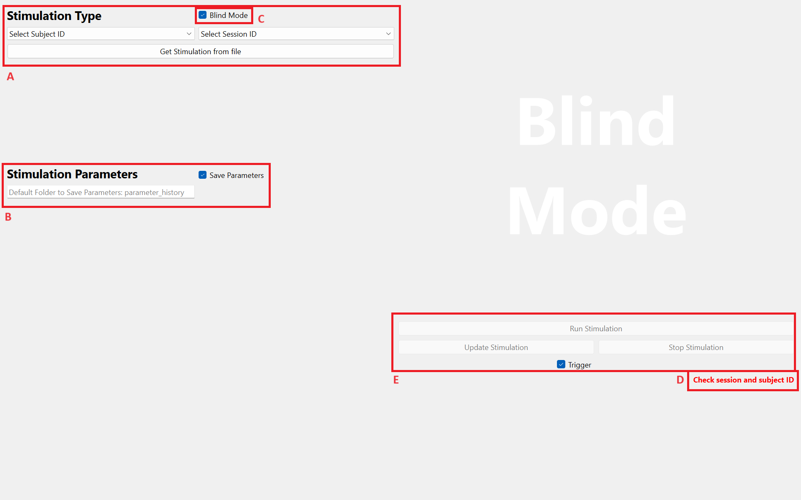

# HummelGUI
The Graphical User Interface (GUI) proposed here controls a data aquisition system (DAQ) that can be used control electrodes for non-invasive brain stimulation. This repository contains the code for the GUI, as well as utility files, notably for defaults values. The following sections explain the GUI's dependencies and compatibility with DAQs, as well as its functionalities and features.
___
## GUI Functionalities
The GUI proposed here offers two seperate modes: "Settings Mode" and "Blind Mode". These appear as follows.

### Settings Mode
The "Settings Mode" is available to manually select a stimulation type, adjust parameters, and plot corresponding waveforms for visualisation. This mode is meant for testing, preparing and checking a specific setup or stimulation type.

In this mode, one first selects the base stimulation type from the corresponding dropdown menu (A). Currently available stimulations include iTBS, cTBS, TBS control and TI. These can be selected as follows. As a note, how to add new stimulation types is explained further down.

Once the stimulation type is selected, the default parameters defined in [util.py](HummelGUI/util.py) can be modified directly through the GUI (B). The parameters that may be modified include duration parameters such as total duration of the stimulation, ramp-up and ramp-down time, frequency parameters such as carrier, pulse and burst frequencies, and current parameters such as the sum and ratio of currents. Default parameters can be reset thanks to the corresponding button.

Once parameters are chosen, the resulting waveform can be plotted and shown on the GUI for verification (C). Here zooming on the plot stretches the x axis, but the y axis remains between the signal's minimum and maximum. This allows for easy verification of the signal's form. Resetting the graphs view to the default view can be done in the bottom left corner of the plot. As a note, in "Settings Mode", this step is necessary before being able to run the stimulation. 

Once plotted, buttons to run the stimulation become available (D). If the "trigger" checkbox is selected, pressing this button will prime the stimulation and wait for an external trigger to begin. In addition, "update" and "stop" buttons become available during a stimulation, to update to a new stimulation type or parameters or stop the stimulation before its predefined end. Also, a number of times the stimulation is to be run ca be selected. Importantly, this count does not reset when updating the stimulation. These settings are available as follows.

Finally, a label will guide the experimenter in the use of the GUI (E). This label indicates if a stimulation is running, waiting for a trigger, ramping-down after pressing the "stop" button or waiting for the experimenter to select a stimulation. Other labels will appear in "Blind Mode". 

### Blind Mode
The "Blind Mode" is available to carry out experiments on participants for a study. In this mode, the stimulation type, waveform and all parameters are hidden from the experimenter. 

Instead, the experimenter can first select the subject and session's ID from dropdown menus (A). Here only IDs that exist can be selected, depending on the data of the predefined excel file. From this same data, the stimulation type is chosen according to the IDs, and the parameters are read from default values. These default values, as well as the filename of the excel file, can be set prior to the study in [util.py](HummelGUI/util.py).

Once chosen, the experimenter uses the corresponding button to load the stimulation. The label (D) will then provide information on the status of the GUI. If all is in order, the GUI will be "Ready". Otherwise, the label will indicate to the experimenter if an issue is detected. This issue may be unselected IDs, a non-existing file or an unknown stimulation type defined in the excel file.

Before running the stimulation, the experimenter can choose to save or not the parameters to a seperate csv file for later use (B). This file (named _subjectID_sessionID.csv_) saves all parameters discussed above, as well as a time stamp of when the stimulation begun. This feature is also available in "Settings Mode". When a stimulation is updated, the new parameters are appended to the previous, in the same file. The default directory (_parameter_history_) in which these files are saved can be changed from the GUI.

Once set, the experimenter can run the stimulation as in the "Settings Mode", also with update, stop and trigger functions available (E). 

To toggle between these two modes, the experimenter must check or uncheck the "Blind Mode" chcekbox (C), as shown below.

### Defaults
All defaults can be set in [util.py](HummelGUI/util.py). This includes the default opening to "Blind Mode" or "Settings Mode", all default parameters for stimulations, the DAQ device name and the excel file name storing stimulations for specific IDs. Most important defauts are located at the head of the [util.py](HummelGUI/util.py) file.
___
## How to install/Dependencies
coming soon...
___

## Setting up the DAQ
This GUI has been built for, and is intended to be used with National Instruments' [USB-6341 DAQ](https://www.ni.com/docs/en-US/bundle/usb-6341-specs/page/specs.html). The GUI might be compatible with others, but not all. In particular, certain features are **not compatible** with the [USB-6216](https://www.ni.com/docs/en-US/bundle/usb-6216-specs/page/specs.html).

To link the present GUI to the DAQ and [stimulators](https://www.digitimer.com/product/human-neurophysiology/peripheral-stimulators/ds5-isolated-bipolar-constant-current-stimulator/), the experimenter must first connect the computer running the GUI to the DAQ via a USB cable. Thereafter, two BNC cables run from the DAQ to either stimulator, and one runs to the computer running the tasks of the study (not the GUI computer) (see also the image below): 
- BNC cable 1 (red): from the **AI0** channel of the DAQ to the input channel of the first stimulator
- BNC cable 2 (red): from the **AI1** channel of the DAQ to the input channel of the second stimulator
- BNC cable 3 (blue): from the **PFI0** channel of the DAQ to trigger port of the task computer
[pinout](demo/pinout.png)

In addition to the labels proposed by the GUI, it is important to check the status of the physcial DAQ through the informative LEDs. In particular, when connected to a computer, the DAQ becomes "Ready" (one LED); when sending data through to the stimulators, the DAQ becomes "Active" (two LEDs).
___
## Launching the GUI
coming soon...
__

